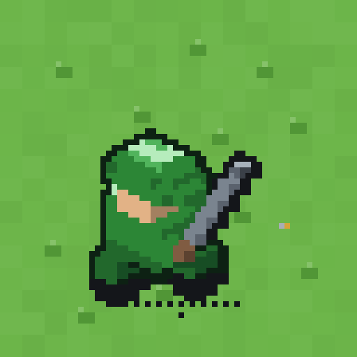
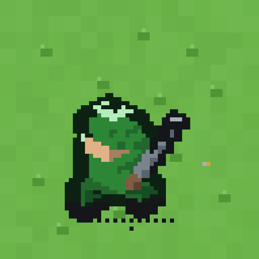

# Composite legibility — 2026-08-19 (generator `0d87068`, round 10)

What the sweep finds on the sheets shipped by generator `0d87068`, which weighs the contour in
**logical pixels** rather than in source pixels. A dated measurement — it supersedes the previous
page wholesale rather than editing it, the way `docs/bulwark_balance.md` and
`docs/replay_survey.md` are superseded.

## Re-read 2026-08-19, after the solid cast shadow (generator `55d2b65`)

The board's cast shadow became solid and the sub's wake with it, so board pixels moved and this
page was re-read rather than re-authored: **1,284 failing (15.9%) clear and 123 (6.8%) fogged**,
against the **1,276 (15.8%) / 118 (6.6%)** below. The control is exact — the shipped harness run
against the *previous* atlas reproduces this page's headline to the cell — so the whole of the
difference is 13 cells, and **every one of the 17 that crossed to failing is the sub** (4 crossed
back on woods). The mechanism is the wake, not the shadow: it is continuous now, so bright foam
sits on the silhouette's contour and against pale shoal or a property lot it is close in value.
827 of the 9,900 rows moved their edge reading, 452 of them the sub's.

No class moved and nothing was tuned in response. Every finding, table and gallery below still
describes the art as this page found it, and the next full campaign supersedes the page wholesale.

**Nothing was tuned in response to it.** No colour anywhere moved for this run, and **the ruler is
unchanged from round 9** — same edge reading, same two-step bar, same hue bound of 20, same
one-step fog bar, same `max` gallery sort. Every number below is the generator's art read back
through the previous page's instrument.

Re-run with `make legibility-check`. It reads the shipped atlases and the shipped constants, plays
no match, takes about a minute, writes `cells.csv` and `summary.md` under `reports/` (gitignored) —
and redraws the one artifact it publishes, the worst-twenty gallery below.

## The ratchet

`make legibility-ratchet` runs the same sweep and diffs its verdicts against
`tests/fixtures/legibility_baseline.csv`, the committed PASS/FAIL per cell. **It fails only where a
cell that passed in the baseline fails now.** A cell that newly passes is printed and nothing more:
the rule this page is written under is unchanged — a failing cell is a finding for the art to
answer, never a colour to move — so the ratchet holds the line rather than demanding it improve. A
cell the baseline does not know about, or one it knows and this run no longer measures, is listed
too; both mean the matrix itself moved, which is a re-baseline and not a regression.

Only the verdicts are committed, never the readings, so a re-render that moves a ramp step without
crossing the bar leaves the file alone. A cell is named by view, frame, unit, faction, state,
terrain and overlay — not by the terrain variant, which is the worst-scoring tile of that family
and may change hands without the verdict moving.

Re-baseline with `make legibility-baseline` after an **intended** art change, alongside `make
tiles`: read the new sweep first, then commit the digest with the art it describes. It is out of
`make verify` for the sweep's own reason — it renders the whole matrix and takes about 24 minutes on
a loaded machine — so it is a step before an art merge, not a per-commit gate.

## Re-read 2026-08-19, over the terrain variants

The ruler now reads a ground on every tile its family can draw and reports the worst (see *What is
measured*), where it used to read the one tile a single probe cell happened to wear. Only open water
has more than one tile today, and the re-read is **1,291 failing (15.9%) clear and 123 (6.8%)
fogged** against the 1,284 (15.9%) / 123 (6.8%) above: **the whole difference is the sea, 90 → 97**,
and the headline percentages are unmoved. The three phases are alike but not identical — of the
sea cells, phase 2 wins the worst-of 151 times and fails 16.6% of them against phase 1's 7.3%, so a
phase is worth naming even now. Nothing was tuned in response, and no other terrain, unit,
faction or class moved by a cell.

## Re-read 2026-08-20, after plains gained phases (generator `21175fc`)

Plains is now a phase-keyed family like the sea — three tiles, phase 0 the atlas column byte for
byte — so the ruler reads it three ways and reports the worst. It is the reference ground most
contrast pairs are read against, which is what made this the real gate for that change, and it
**costs the board nothing**: **1,291 failing (15.9%) clear and 123 (6.8%) fogged**, the previous
re-read's numbers to the cell, and `plains/0`, `plains/1` and `plains/2` each fail **0 of their
cells**, as the single plains tile did. No unit, faction, overlay or other terrain moved by a cell,
and nothing was tuned in response. Only the `terrain/variant` table gained rows.

## Re-read 2026-08-20, after mountain gained phases (generator `8569ba4`)

Mountain is phase-keyed now for the reason plains is, read at its loudest: it is the most
silhouette-dominant tile on the board, so a range drawn from one of them is a wall of the same peak.
A phase moves the summits, the ridges under them and the snow-line seed and **nothing else** — the
ground line and the contact shadow are fixed, so a range stands on one horizon — and the ruler reads
all three and reports the worst. It **costs the board nothing**: **1,300 failing (16.0%) clear and
123 (6.8%) fogged**, which is a same-day control on the atlas-only mountain to the cell (1,300 /
123), and the `mountain` row is 21 failing (2.6%) in both readings. The worst phase is **`mountain/2`
at 13.6%** of the 59 probe cells it wins, against `mountain/1`'s 0.0% of 312 — worth naming, like the
sea's phase 2. One failure moved from value-blind to hue-carried and nothing else did; no unit,
faction, overlay or other terrain moved by a cell, and nothing was tuned in response.

## Re-read 2026-08-25, after the animation install (generator `e16d261`) — A REGRESSION

The animation install regenerates every sheet on the board, and the ruler reads it far worse than
the art it replaces: **7,023 failing (86.7%) clear and 1,439 (79.9%) fogged**, against a same-day
control on the previous art of **1,300 (16.0%) / 123 (6.8%)** — the same harness, the same 8,100 +
1,800 cells, the ramp step unmoved at 0.1549 against 0.1543. This is a finding, not a tuning: no
colour was moved in response, and the art is installed byte-identical to the generator.

**The failure is at board resolution and only there.** The `board` view fails 94.8% of its cells
where the `cutin` view — the same figures at 1:1 — fails 21.6% (control: 17.6% / 4.0%). The board
draws the 64 px cell onto 16 px with nearest filtering, so a contour that is not several source
pixels thick is three-quarters unsampled; round 10's per-edge band is what bought the 15.8% this
page is a reading of, and the new cells do not read as carrying it. 71.1% of the clear failures
still clear the hue bound, so the board is value-blind rather than illegible — the shapes are told
apart by colour, which is exactly what the two-reading bar exists to count rather than pass.

Frame B is the same reading: **7,073 (87.3%) / 1,459 (81.1%)**, board 96.2% against cut-in 16.1%
(`make legibility-check LEGIBILITY="--units=assets/tiles/units_atlas_b.png"`). So the beat costs
nothing on top of the install — both frames are the install's art.

Everything below this line still describes the `0d87068` art. The next generator round supersedes
this page wholesale; until one does, **read the headline as the previous art's and this section as
what shipped over it**.

## Re-read 2026-08-29, over the frame axis — all six unit sheets

The ruler had read one sheet of the six the game ships. It now reads a **frame** — a clip and a
beat — on every row: the board's `idle_a` / `idle_b` (the ambient pair) and `walk_a` / `walk_b`
(the gait pair a unit wears while `BattleAnimator` tweens it along a path), and the cut-in's
`idle_a` / `idle_b`, which are the *figure* sheets, the same poses with the tile's cast shadow
subtracted. Which file a frame is drawn from is the view's, exactly as `UnitSprite._sheet_path`
and `UnitSprite.figure_texture_for` decide it in the scene. The matrix is **37,800 composites**
where it was 9,900, `frame` is a column in `cells.csv`, a table in `summary.md`, a caption line in
the gallery and the second field of `--dump`, and the ramp step is unmoved at **0.1549**.

Nothing was tuned in response and the ruler is unchanged: same edge reading, same bars, same hue
bound, same gallery sort.

| view / frame | sheet | clear cells | failing | median edge | fogged failing |
| --- | --- | --- | --- | --- | --- |
| board `idle_a` | `units_atlas.png` | 7,200 | 6,829 (94.8%) | 1.15 | 1,439 (79.9%) |
| board `idle_b` | `units_atlas_b.png` | 7,200 | 6,928 (96.2%) | 1.17 | 1,459 (81.1%) |
| board `walk_a` | `units_atlas_move.png` | 7,200 | 6,951 (**96.5%**) | 1.11 | 1,491 (82.8%) |
| board `walk_b` | `units_atlas_move_b.png` | 7,200 | 6,862 (95.3%) | 1.15 | 1,456 (80.9%) |
| cut-in `idle_a` | `units_atlas_figures.png` | 900 | 422 (46.9%) | 2.00 | — |
| cut-in `idle_b` | `units_atlas_figures_b.png` | 900 | 399 (44.3%) | 2.01 | — |

Whole run: **clear 30,600 cells, 28,391 failing (92.8%)**, 19,869 of them hue-carried; **fog 7,200
cells, 5,845 failing (81.2%)** at the one-step bar.

**The two frames this page had already read reproduce it to the cell.** Board `idle_a` is
94.8% clear / 79.9% fogged, which is the 2026-08-25 section's headline exactly, and board `idle_b`
is 96.2% / 81.1%, which is that section's `--units=units_atlas_b.png` probe exactly. The axis
therefore adds readings without moving one.

### The four findings

1. **The gait sheets are the install's art, and no better.** `walk_a` is the worst frame on the
   board (96.5% clear, 82.8% fogged) and `walk_b` the middle of the pack; both sit inside the
   spread the ambient pair already had. The move clip did not introduce a legibility problem of its
   own and it did not answer the install's — the whole board still fails at ~95% for the reason the
   2026-08-25 section gives, one source pixel in four surviving the board's decimation.
2. **A frame is a real axis, not a rounding difference.** Between `idle_a` and `walk_a`, 6,720 of
   the 9,000 board cells (both classes) move their edge reading and **267 cross to failing against
   93 the other way**; `idle_a`→`idle_b` is 6,836 moved, 268 / 149. Per unit the spread is widest
   on the **sub (73.8% idling, 90.8% walking, clear class)**, the tank (85.5% `idle_a` to 97.2%
   `walk_a`) and the APC.
   Reading one frame was reading one of four boards.
3. **The cut-in row changed subject, and it was wrong before.** It used to be measured off the
   board's own cell — cast shadow included — which is art the cut-in never draws. Off the sheets it
   actually draws it reads **46.9% / 44.3%** where the old composite read 21.6% / 16.1%. That is
   the harness correcting itself, not the figures moving: the dark shadow band was contour the
   reading was scoring and the screen never shows. It is still the optimistic direction on one
   count — the director paints its own contact shadow under the figure and this composite does not
   — so treat the cut-in numbers as the figure against bare ground.
4. **The worst-twenty gallery is now all four frames.** Ten of the twenty are gait cells and the
   `lander` fogged on a mountain in `walk_b` is the worst cell in the whole sweep at 0.20 edge steps
   / 3.9 hue. The pairing behind them is the previous rounds' unchanged: pale or grey airframes and
   hulls on masonry, shoal and mountain.

The run takes **24 minutes** on a loaded machine (four times the matrix it was), still writes
`cells.csv` and `summary.md` under `reports/`, and still redraws only the gallery above. A cell is
named `view:frame:unit:faction:state:terrain:variant:overlay` now — for example
`make legibility-check LEGIBILITY="--dump=board:walk_b:lander:iron:ready:mountain:0:fog"`.

## Re-read 2026-08-30, after the mountain was redrawn as a peak (COM-264)

The massif's height field was rebuilt — a steeper flank, ridge crests off each summit instead of
isotropic crag speckle, a wider snowcap and a talus fan carrying the mass out to the footprint's
edge — and the three phases were re-seeded with it. Only `mountain` moved: **34,212 failing (93.2%)
clear and 7,037 (81.4%) fogged**, against the previous baseline's art on the same harness, and the
`mountain` row is 94.4% of its 3,672 cells. **55 verdicts changed, all of them mountain's: 36
crossed to failing and 19 the other way**, a net 17 cells of 45,360.

The mechanism is the speckle. The old flank scattered lit top planes over its whole face, and a
sprinkle of bright pixels behind a contour is worth p25 edge steps whatever it does to the read; the
new flank spends its light on continuous crests, so a stretch of outline that used to fall on a
stray light pixel now falls on one plane. No colour moved for a cell: the one thing this sweep did
say out loud is that the new talus fan put a lot more of the rock's darker band under a silhouette,
so `MASSIF_TALUS` went 3 to 2, and running it again after that turned a good share of the losses
back. The board is at 93.2% for the reason the 2026-08-25 section gives, so 17 cells on one terrain
is inside that regression, not a reading of this change.

The baseline digest was rewritten for it (`make legibility-baseline`), which is what that target is
for after an intended art change.

## Re-read 2026-08-30, after the movement wash was made a claim

The reach overlay's baked tile went to a hard edge (fill 86 → 160, edge 127 → 255 in
`generators/sprites/spritegen/chrome.py`) and `OverlayPalette.MOVE` turned mint; `ATTACK`'s palette
alpha dropped so its fill lands where it did. The sweep reads the shipped overlay tile and the
shipped palette, so it answers for the change: **31,832 failing (86.7%) clear and 7,037 (81.4%)
fogged**, against 34,212 (93.2%) / 7,037 (81.4%) above. **2,542 verdicts moved — 2,461 recovered
and 81 regressed** — and both sides are the two washes that changed: 2,451 recoveries and 77 losses
under `move`, 10 and 4 under `attack`, none under `threat`, `fog` or `none`. The `move` row is now
67.8% failing against `attack`'s 95.8% and `threat`'s 95.6%.

The mechanism is that the wash lies under the figure: a denser, brighter mint ground puts more
separation behind a dark contour, which is most of the board. The 81 losses are the other end of
the same lever — the pale hulls on the pale grounds, 39 of them the **sub** and 14 the
**battleship**, 47 of the 81 **iron**, and 40 of them on `shoal` or `sea`, where the wash lifts a
ground that was already close to the figure past it. It is a finding for the art, not a colour to
move back: the wash exists to be seen, and the reach it delimits is the more gameplay-critical read.

The digest was rewritten for it (`make legibility-baseline`) and the gallery redrawn with it.

## Re-read 2026-08-30, after the mountain became one peak with a cap

The redraw above kept three near-equal summits and a cap too dim to tell from the rock beside it;
playtest still read the tile as a rock pile. This pass gives every phase **one dominant summit with
shoulders under it**, measures the snow line **down from that summit** so only it wears a cap, and
draws the cap a ramp slot higher (`palette.TERRAIN_MATERIALS`, `snowcap` on S4) — the snow ramp's
own top three rungs, brightest L172, still under the ceiling that reserves the top band for units.

It **buys the board cells**: **31,811 failing (86.63%) clear and 7,011 (81.15%) fogged**, against
the previous baseline's 31,832 (86.69%) / 7,037 (81.45%), and the `mountain` row is 86.88% of its
4,536 cells against 87.92%. **73 verdicts changed, every one of them mountain's: 60 crossed to
passing and 13 the other way**, a net 47 cells of 45,360. Nothing was tuned in response, and no
unit, faction, overlay or other terrain moved by a cell.

One thing the sweep did say out loud, and the art answered: a first cut drew the band of rock
**under** the snow line a rung darker, which is how a real snow line reads and read well on the
tile. It puts the massif's darkest rung over the middle of the cell, which is where a unit stands,
and the ratchet came back with mountain cells that had passed and no longer did — almost all of
them `acted` or fogged units, whose own values are dimmed. That band is not in the shipped art; the
cap is read by its own rungs alone.

The 13 losses were read one by one and accepted; darkening the cap's top rung to answer them would
trade away the light terminal that bought the 60. They fall in three classes:

- **Nine are the accepted grey-on-grey residual** — seven iron and two neutral, eight in clear
  view and one fogged (`walk_a|b_copter|iron|ready|mountain|fog`). Grey liveries on grey rock is
  the pairing this page has named since round 9 and the cap does not change it.
- **`walk_a|rockets|aurora|ready|mountain|fog` is its own item, under the fog residual** — a
  chromatic livery the shroud pulls to the rock's own value. Named here so it is findable if the
  fog isolation rate is ever revisited.
- **Two are a new class, `acted`-under-wash** — `fighter|aurora|acted|mountain|move` and
  `recon|aurora|acted|mountain|move`: the deliberate `acted` dim meeting the lit mint reach wash
  the section above installed. Neither the mountain's problem nor grey-on-grey's, and the watch
  condition is that the class stays on mountain. If it ever appears on another ground, the answer
  is the wash's value or the `acted` dim's floor — a renderer and overlay ruling — and never
  per-terrain art.

The remaining cell, `idle_b|apc|verdant|ready|mountain|attack`, is logged against the standing
verdant hue-gap follow-up (round 11's saturation residual, finding 7 below) as that follow-up's
concrete worst case.

The baseline digest was rewritten again (`make legibility-baseline`), so the 60 gains are the line
the next change is held to.

## What the generator changed

The board draws a 64 px cell onto a 16 px grid with nearest filtering: it keeps one source pixel in
four. Round 9 made every unit's outer boundary structurally its S0 outline and the APC still failed
99.2% of its board cells, because a **1 px** contour is three-quarters unsampled and which quarter
survives is an accident of where the edge falls. Round 10 states the band per edge in source pixels
— 4 on the lit (top and left) edges, 2 on the ground-facing ones — so a board-scale sample lands on
contour whatever the phase. The band grows **inward**, off the faction plane behind the edge; the
outward halo is round 9's unchanged, because the md_tank already fills 63 of the 64 px its cell
allows.

The control is exact: the **previous** units sheet, read by this harness at today's bars, reproduces
the previous page's headline of **4,082 failing (50.4%)** and its fog line of **512 (28.4%)** to the
cell.

## What is measured

Every cell of 18 units × 5 faction rows × {ready, acted} × ten grounds × {no wash, move, fire,
threat, fog} at board resolution, plus the same figures at the cut-in's resolution — **9,900
composites**, stacked in battle.tscn's own node order: terrain, the wash over it, the unit over
that, the fog shroud over everything. One ramp step is **0.1543 luminance**, measured off the
shipped units atlas.

A ground is measured on **every tile its family can draw** where its own kind surrounds it, and the
row reports the **worst** of them, named — open water, plains and mountain are three phases each of
their own sheets, everything else on the board is one tile today. So a row is keyed by a tile rather
than by a terrain: the
`variant` column beside `terrain` in `cells.csv` and in the `terrain/variant` table names it (a
phase index, a connection mask, or `atlas` for a base-atlas cell), and `--dump` takes it as its
sixth field. Which variants exist is asked of `TerrainAutotiles` by walking a probe cell along a row
of its terrain, so a family that gains phases is measured through them without this harness learning
its name.

## The headline

**Clear class: 8,100 cells, 1,276 failing (15.8%) at two ramp steps** — down from 4,082 (50.4%).
783 of those failures (61.4%) are 20 or more apart in hue — value-blind rather than illegible —
which leaves **493 doubly blind** and **2 severe on both** (under half the bar *and* under 20 hue).

**Fog class, reported separately: 1,800 cells, 118 failing (6.6%) at one ramp step**, 101 of them
doubly blind.

| class | previous (`30c1e97`) | shipped (`0d87068`) |
| --- | --- | --- |
| clear, failing | 4,082 (50.4%) | **1,276 (15.8%)** |
| clear, doubly blind | 963 | **493** |
| clear, severe on both | 151 | **2** |
| fog, failing at 1.0 | 512 (28.4%) | **118 (6.6%)** |
| fog, doubly blind | 251 | **101** |

**9,528 of the 9,900 rows moved. 3,200 cells crossed from fail to pass and none crossed the other
way** — the first round of this instrument with zero regressions, and the round that finally
cleared the previous page's own two open findings (the APC, finding 3; the lander, finding 4).

| view | median edge steps | failing |
| --- | --- | --- |
| board | 1.89 → **2.61** | 56.2% → **17.2%** |
| cutin | 3.02 → 3.03 | 4.0% → 4.0% |

(clear class; previous → shipped. The cut-in is unmoved to the cell: 36 failures before and after —
at 64 px nothing was ever unsampled, so the fix has nothing to buy there. What it *costs* there is
finding 4.)

| ground | median edge steps | failing | doubly blind |
| --- | --- | --- | --- |
| shoal | 2.28 → **3.22** | 33.3% → **0.0%** | 122 → 0 |
| plains | 2.20 → **3.21** | 32.9% → **0.0%** | 12 → 0 |
| airport | 2.06 → 3.02 | 46.2% → 7.4% | 45 → 14 |
| port | 2.06 → 3.01 | 46.9% → 4.9% | 53 → 6 |
| mountain | 2.13 → 2.81 | 38.9% → 2.9% | 95 → 12 |
| city | 1.73 → 2.65 | 67.4% → 28.3% | 182 → 144 |
| hq | 1.51 → 2.22 | 79.6% → **46.4%** | 199 → 175 |
| sea | 1.79 → 2.17 | 58.1% → 9.9% | 39 → 4 |
| woods | 1.80 → 2.15 | 75.6% → 23.2% | 52 → 10 |
| base | 1.55 → 2.01 | 83.1% → **49.3%** | 164 → 128 |

(clear board rows, every wash.)

| wash | median edge steps | failing |
| --- | --- | --- |
| move | 1.95 → 2.63 | 53.2% → 13.9% |
| threat | 1.91 → 2.60 | 56.3% → 16.8% |
| none | 1.83 → 2.60 | 59.4% → 22.6% |
| attack | 1.90 → 2.59 | 55.9% → 15.6% |
| fog (bar 1.0) | 1.21 → 1.72 | 28.4% → 6.6% |

(board rows. Fog's rate is at its own bar.)

| faction row | median edge steps | median edge hue | failing |
| --- | --- | --- | --- |
| iron | 1.95 → 2.76 | 51.7 | 52.2% → 15.8% |
| aurora | 1.86 → 2.65 | 53.4 | 56.1% → 21.4% |
| meridian | 1.84 → 2.63 | 52.1 | 56.1% → 21.9% |
| neutral | 1.69 → 2.51 | 45.4 | 65.6% → 22.5% |
| verdant | 1.75 → 2.45 | 42.3 | 66.9% → **31.4%** |

(bare board, no wash.)

| unit | median edge steps | failing | doubly blind |
| --- | --- | --- | --- |
| tank | 2.89 → 3.19 | 8.2% → 2.5% | 1 → 0 |
| anti_air | 1.70 → **3.18** | 72.2% → **0.2%** | 12 → 0 |
| rockets | 2.09 → 3.17 | 43.5% → 3.5% | 32 → 1 |
| md_tank | 1.34 → **3.16** | 78.0% → **0.5%** | 37 → 0 |
| artillery | 2.15 → 3.14 | 32.5% → 0.0% | 3 → 0 |
| recon | 2.84 → 3.12 | 14.2% → 2.5% | 1 → 0 |
| apc | 0.89 → **2.99** | 99.2% → **11.8%** | 58 → 4 |
| lander | 1.84 → **2.79** | 69.8% → **9.8%** | 51 → 1 |
| missiles | 2.36 → 2.67 | 19.8% → 0.5% | 7 → 0 |
| cruiser | 1.93 → 2.54 | 52.5% → 23.5% | 33 → 6 |
| battleship | 2.22 → 2.45 | 30.2% → 12.8% | 21 → 13 |
| b_copter | 1.88 → 2.33 | 57.8% → 27.0% | 57 → 47 |
| sub | 2.13 → 2.30 | 31.5% → 12.8% | 34 → 11 |
| t_copter | 1.97 → 2.28 | 53.8% → 30.8% | 72 → 61 |
| bomber | 1.12 → 2.27 | 96.2% → 32.2% | 151 → 76 |
| infantry | 1.50 → 2.14 | 95.2% → 40.0% | 159 → 86 |
| mech | 1.71 → 2.12 | 78.2% → 37.8% | 110 → 84 |
| fighter | 1.58 → **1.84** | 78.5% → **62.0%** | 124 → 103 |

(clear board rows, every wash, 400 cells each. The sweep's own per-unit table counts the cut-in rows
too, which is why it reads the APC at 10.9% and the lander at 9.1%.)

## Findings

1. **The APC is answered, and it was the point of the round.** 99.2% → 11.8% failing, median 0.89 →
   2.99 steps. Its flagship cell — the neutral APC on plains, which the previous page recorded at
   **0.05 edge steps** before *and* after round 9's fix — now reads **3.46**. The previous page's
   diagnosis was that the outline was the right kind of pixel and the wrong value; the real answer
   was that at board scale three of its four pixels were never sampled at all.
2. **The lander regression is gone, and no unit regressed to replace it.** The lander goes 69.8% →
   9.8% and its worst cell (a meridian lander greyed out on a city, 1.39 steps) now reads 3.42.
   Across all 9,900 rows, **3,200 crossed to pass and zero crossed to fail** — every previous round
   of this instrument traded some cells for others.
3. **Five units are now effectively solved and two grounds are perfect.** Anti-air, md_tank,
   artillery, missiles and rockets all sit at or under 3.5% failing with zero or one doubly-blind
   cell; plains and shoal fail nothing at all, and sea, port, airport, mountain and woods are all
   under 10%. The whole remaining problem is one shape of cell.
4. **The band is real weight, and the cut-in is where it is paid.** The sweep cannot see this — the
   cut-in reads 36 failures before and after, because a thicker contour can only ever help a
   figure-vs-ground reading. Measured off the sprites instead: the silhouette is unchanged to the
   pixel (the halo did not grow), but **6.2% to 17.2% of every figure's interior was darkened into
   contour** — battleship 6.2%, md_tank 9.3%, APC 10.0%, mech 14.1%, and the **infantry worst at
   17.2%**, because a 4 px band is a large share of a 681 px figure. At board scale that is
   invisible and good. At cut-in scale the smallest figures read heavier — closer to inked than to
   crisp — which is finding 4's whole content and the one thing a human should look at before this
   is called finished. It is a *judgement*, not a defect the sweep found: see the pair below.
5. **What is left is grey aircraft on grey masonry, and it is the previous page's finding 5
   unchanged.** Base (49.3%), HQ (46.4%) and city (28.3%) hold nearly every survivor; the fighter
   (62.0%), infantry (40.0%), mech (37.8%), t_copter (30.8%) and bomber (32.2%) hold nearly every
   unit-side one. The gallery is twenty cells of exactly that pairing. A contour weight cannot fix
   it: the outline is dark and the roof is dark, so the figure is separated from the grass and not
   from the building. That is a property-column value question, and it is the next round's.
6. **Fog is close to free now.** At its own one-step bar the shroud fails 6.6% of its cells, down
   from 28.4%. What survives the wash is contour, and there is now four times as much of it.
7. **Verdant is still the weakest livery** (31.4% on the bare board against iron's 15.8%) and the
   gap is still hue: green figures on green ground. The contour narrowed it — verdant was 66.9% —
   without answering it, because the contour is not the livery.

## The gallery

`make legibility-check` redraws this sheet: the twenty cells with the least margin on the **further**
of the two readings, each magnified to one tile and labelled with its unit, faction, ground, wash,
state, view, both edge numbers and both median ones.

**No APC appears on it** — the previous page's sheet held four. It is now twelve fighters, five
bombers and three t_copters, one of them fogged and nothing else on it: aircraft parked on an HQ or
a base, every hue under 11, which is the doubly-blind class the `max` sort exists to surface. Read
it with finding 5.

## Spot checks

Three composites read by eye, each dumped by the harness itself
(`make legibility-check LEGIBILITY="--dump=board:apc:neutral:ready:plains:atlas:none"`), which
prints both readings beside the crop.

The round's headline, at the cell two previous rounds could not move: a neutral APC on plains,
**0.05 → 3.46 edge steps**. Nothing about the model changed; the outline is simply thick enough to
survive the board's one-in-four sample:

The previous page's regression, answered: a meridian lander on a city, greyed out, **1.39 → 3.42**:

What is left, at its worst: a verdant fighter on an HQ, **1.02 edge steps at 3.6 hue** — dark grey
airframe on dark grey masonry, blind on both readings, and untouched by anything a contour can do:

## The cost, at cut-in scale

Finding 4 as a picture rather than a percentage: the same verdant infantry in the cut-in's own
resolution, previous sheet then shipped. The silhouette is identical; the band has taken the left
shoulder and squeezed the helmet's lit face to a sliver. This is the roster's smallest figure and so
its heaviest case.

The generator measured a 4-px-on-every-edge variant as better still on the board (12.8% clear
against this one's 15.8%) and did not ship it, for this reason. Whether even the shipped band is too
much for the cut-in is a human call on the frames, not something this sweep can answer — it reads
figure against ground, and more ink always wins that reading.

## What the grounds are

Each terrain is measured as the art the board draws for it when its four neighbours are the same
terrain — asked of `TerrainAutotiles`, never picked by hand. That is the base atlas cell for the
five properties and the reef, a wood inside a wood (its full-bleed canopy), the shoal sheet's mask-0
cell for a beach, and a phase of its own sheet for open water, plains and mountain — the phase the
board itself draws at the probe's own cell.

A property's column is a transparent overlay, so its cell is composed over `TerrainDB.ground()`
exactly as `BattleView`'s two layers compose it. A wood's *fringe*, a coastline, a road, a river
and a bridge draw from their own sheets and are still not in this sweep: they are edges rather than
fields, and a unit standing on one is standing on a tile the sweep's field-of-its-own-kind probe
cannot state. Widening to them supersedes this page.
