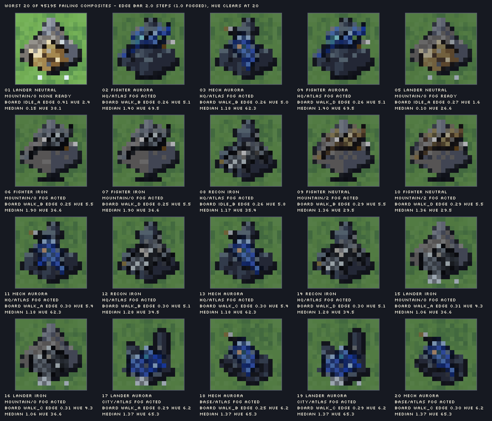

# Composite legibility — 2026-08-18 (two readings, and the worst twenty)

What the sweep finds on the sheets shipped by generator `1216fd5`, measured twice per cell:
in **value**, as before, and now in **hue** beside it. A dated measurement: it supersedes the
previous page wholesale rather than editing it, the way `docs/bulwark_balance.md` and
`docs/replay_survey.md` are superseded.

**Nothing was tuned in response to it.** No colour anywhere moved for this run — the sheets are
the ones the previous page measured, and its value numbers reproduce exactly. Every failing cell
below is a finding for the art to answer; the instrument exists so that answer can be measured
rather than argued.

Re-run with `make legibility-check`. It reads the shipped atlases and the shipped constants, plays
no match, takes about 30 seconds, writes `cells.csv` and `summary.md` under `reports/`
(gitignored) — and redraws the one artifact it publishes, the worst-twenty gallery below.

## What is measured

Every cell of 18 units × 5 faction rows × {ready, acted} × ten grounds × {no wash, move, fire,
threat, fog} at board resolution, plus the same figures at the cut-in's resolution — **9,900
composites**. Each is stacked in battle.tscn's own node order: terrain, the wash over it, the unit
over that, the fog shroud over everything.

**Separation** is the median luminance of the figure's pixels minus the median luminance of the
ground plate under it, in **ramp steps**. One ramp step is the gap between two neighbouring slots
of a faction ramp, measured off the shipped units atlas rather than restated: **0.1543 luminance**,
unmoved from the previous two runs.

**Hue** is the CIE76 distance between the same two colours in Lab's chroma plane —
`sqrt(da² + db²)`, D65, sRGB linearised on the way in. It is taken between *exactly* the pair the
value bar compared: `LegibilityMetric.median_colour` names the colour whose luminance the median
is, so the two readings can never be about two different pixels.

**Its lightness term is dropped on purpose.** Full CIE76 carries `dL` as well, which is the
difference the ramp-step bar already measures, and the first run of this column proved the cost of
keeping it: with `dL` in, **95.8%** of failures "cleared" a bound of 20, because a pair two ramp
steps apart in grey scores about that much on lightness alone. A column that mostly restates the
bar is not a second reading. In the chroma plane, black against white is 0.

Four things to know before reading a number:

- The two readings answer different questions and the **verdict is the value bar's**: it is what
  predicts legibility at zoom 1, and the neutral and iron liveries have little hue to lean on. The
  hue column is reported beside it and **counted separately, never passed**.
- The bound below which the hue column says nothing useful is stated, not measured: **20**, about
  eight just-noticeable differences. Moving it supersedes this page.
- The ground is the **whole tile**, not the pixels the silhouette leaves showing.
- The figures are the **ambient frame A** atlas; the board also beats to frame B, which is not in
  this sweep. The board reading samples one texel per screen pixel (nearest filtering), so a unit's
  board median is not its cut-in median.

## The headline

**6,278 of 9,900 cells (63.4%) are under two ramp steps — and 5,214 of those 6,278 (83.1%) are
20 or more apart in hue.** The value-only page read as if two thirds of the board were
illegible; four fifths of that two thirds is a figure the player can still pick out, by colour,
in exactly the cases the ruler is blind to.

**1,064 failures clear neither reading**, and 334 of them are severe on both (under one ramp step
*and* under 20 hue). That set is the real finding, and it is concentrated: **woods (151 cells) and
sea (52)**, in the **neutral (146) and verdant (82)** liveries.

| ground | median steps | median hue | failing | of those, hue-carried | ground luminance |
| --- | --- | --- | --- | --- | --- |
| shoal | 2.10 | 29.1 | 44.0% | 64.1% | 0.650 |
| plains | 1.95 | 47.7 | 50.7% | 90.1% | 0.618 |
| city | 1.91 | 47.4 | 53.2% | 90.0% | 0.612 |
| base | 1.91 | 47.4 | 53.2% | 90.0% | 0.612 |
| port | 1.91 | 47.4 | 53.2% | 90.0% | 0.612 |
| airport | 1.91 | 44.8 | 53.2% | 85.6% | 0.612 |
| mountain | 1.90 | 45.8 | 53.2% | 85.8% | 0.612 |
| hq | 1.88 | 45.8 | 54.4% | 83.7% | 0.608 |
| sea | 0.91 | 46.2 | 97.1% | 87.3% | 0.404 |
| woods | 0.61 | 32.1 | 99.9% | 79.1% | 0.338 |

(board rows only, every wash)

| wash | median steps | median hue | failing | of those, hue-carried |
| --- | --- | --- | --- | --- |
| none | 2.06 | 65.5 | 45.8% | 89.4% |
| move | 1.98 | 34.8 | 52.8% | 86.6% |
| attack | 1.84 | 42.7 | 56.9% | 85.0% |
| threat | 1.84 | 42.5 | 57.1% | 81.0% |
| fog | 1.36 | 47.2 | 93.6% | 83.1% |

| faction row | median steps | median hue | failing | of those, hue-carried |
| --- | --- | --- | --- | --- |
| iron | 2.43 | 65.5 | 34.4% | 100.0% |
| aurora | 2.13 | 100.5 | 35.0% | 78.6% |
| meridian | 2.05 | 78.0 | 35.6% | 100.0% |
| verdant | 1.85 | 27.1 | 52.8% | 76.8% |
| neutral | 1.51 | 51.1 | 71.1% | 93.8% |

(bare board, no wash)

## Findings

1. **The value bar overstates the problem by about a factor of five.** Of 6,278 failures, 5,214
   carry enough colour to be told apart anyway and 1,064 do not. The submarine on open water is
   the case that motivated the column and it is now measured rather than argued: **1.10 steps and
   65.2 hue** — invisible to the ruler, obvious on screen.
2. **Woods is the one ground where both readings agree it is bad.** It fails 99.9% of its board
   cells on value *and* carries the lowest hue of any field but shoal (median 32.1), because the
   lit canopy is a mid-green and half the roster is painted mid-something. 151 of the 334
   doubly-blind cells stand in it.
3. **The verdant livery is the one that disappears into the board it fights on** — median hue
   27.1, the lowest of the five, against aurora's 100.5. Green units on green ground is a hue
   collision the value bar cannot see and this column can.
4. **Iron and meridian carry 100% of their value failures on hue**, which is the other half of
   the same point: their paint is far enough from grass and water that a value collision costs
   nothing in practice.
5. **Neutral is still the weakest livery on value** (median 1.51 steps, 71.1% failing) but 93.8%
   of those failures clear the hue bound — its problem is that it is *close in value to
   everything*, not that it vanishes.
6. **The washes cost hue as well as value.** The move wash halves the median hue of the cells it
   covers (65.5 bare to 34.8), because a translucent blue over the ground pulls the ground towards
   the colour half the roster already is. Fog costs the most value (down to 1.36 steps) and, sitting
   above the units, drags both sides together.
7. **The worst single cells are hue-blind rather than value-blind**: a verdant unit on woods under
   fog reads **0.31 steps and 0.66 hue** — the two colours are the same colour. Nothing else in the
   sweep comes close on both readings at once.
8. **The cut-in is worse than the board on both** (85.3% failing against 61.2%, and only 71.7% of
   its failures hue-carried), which is the sampling note above rather than a second defect.

## The gallery

`make legibility-check` redraws this sheet: the twenty worst-scoring composites, each magnified
to one tile and labelled with its unit, faction, ground, wash, state, view and both scores.

It is deterministic — the same art in is the same PNG out, byte for byte, which was checked by
running the sweep twice — because the failure ordering is total: worst by steps, then by the
cell's own six-field key. That tiebreak is load-bearing here: **30 cells score exactly 0.00
steps**, so "the worst twenty" is a choice among ties, and the key is what makes it the same
choice every run.

Read the sheet with finding 1 in hand. Cells 07–20 are neutral figures at cut-in resolution over
water, all at 0.00 steps and ~71.8 hue: on the ruler they are the worst cells in the game, and on
screen they are tan figures on blue water. Cells 01–06 are the same story at board resolution —
meridian and verdant carriers and bombers over open sea, whose value sits exactly on the water's
and whose paint does not.

## Spot check

Two composites were read by eye, both dumped by the harness itself
(`make legibility-check LEGIBILITY="--dump=board:sub:neutral:ready:sea:none"`, which prints the two
median colours and their hue distance beside the crop).

Known-bad by the ruler, **1.10 steps**, and **65.2** apart in hue — a neutral submarine on open
water (figure `#4a3a22`, ground `#2b70bf`). It is legible at a glance, and the hue column is now the number that says so:

Barely passing, **2.02 steps** — a meridian infantry on a city. The figure stands on the ground
plate beside the building rather than on the masonry:

## What the grounds are

Each terrain is measured as the art the board draws for it when its four neighbours are the same
terrain — asked of `TerrainAutotiles`, never picked by hand. That is the base atlas cell for
plains, mountain and the five properties, a wood inside a wood (its full-bleed canopy), the shoal
sheet's mask-0 cell for a beach, and a phase of the sea sheet for open water — the phase the board
itself draws at the probe's own cell.

A property's column is a transparent overlay, so its cell is composed over `TerrainDB.ground()`
exactly as `BattleView`'s two layers compose it. A wood's *fringe*, a coastline, a road, a river
and a bridge draw from their own sheets and are still not in this sweep: they are edges rather than
fields, and a unit standing on one is standing on a tile the sweep's field-of-its-own-kind probe
cannot state. Widening to them supersedes this page.
