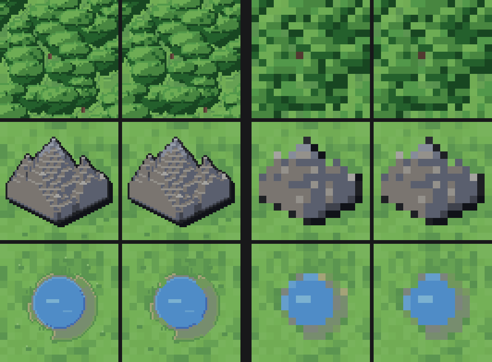

# Terrain grain across the zoom ladder — 2026-08-29

The units' cast shadow was moved to a solid shape because it was measured through the board's own
sampling and found to draw between 0% and 285% of its own density depending on the rung
(`generators/sprites/README.md` "The shadow is drawn for every rung",
`generators/sprites/tests/test_shadows.py::CastShadow`). The ground that shadow falls on had never
been read the same way. This page is that reading.

A dated measurement, superseded wholesale by a later one rather than edited.
**Nothing was tuned in response to it** — no pixel, no tone and no drawer moved for this page, and
no gate was added. Every number below is the shipped art read back through the shadow study's own
instrument.

Re-run with `make grain-census` (about 6 s;
`generators/sprites/tests/grain_census.py --source=both|fresh|installed [--detail]`). It is out of
`make verify` and out of `make sprites-test` for the reason the other readouts are: it is an
instrument, not a bar.

## What is measured — the cells the board actually paints

`scenes/battle/terrain_autotiles.gd` is the one authority for which picture a cell draws, and it
sends almost every ground terrain to an autotile sheet: road, river, bridge and shoal always, sea to
the coast sheet when it has land on an edge and to the sea sheet when it does not, woods to the
woods sheet unless the cell is walled in by wood. Only two `terrain_atlas.png` columns survive as
ground a board really shows — **reef**, which has no family at all, and **woods**, which an interior
wood keeps. So the subject here is **every cell of every sheet the game loads** plus those two
columns: 101 pictures.

Phase 0 of each phase-keyed sheet is that terrain's atlas column byte for byte, and the woods
sheet's mask 15 is the woods column byte for byte; the census checks all four rather than assuming
them, and they hold. Two of the 101 are read without a board ever indexing them: `coast/0` is plain
open sea, which a sea cell with no land on an edge draws from the sea sheet instead, and `woods/15`
is the interior wood's atlas column, read here as well as in that column. The atlas columns for
`road`, `river`, `bridge`, `shoal` and `sea` **are never drawn on a board** — a sheet answers for
every one of those cells — and the property columns are transparent overlays with no ground of
their own.

The board draws the 64px cell onto a 16px grid with nearest filtering, so it keeps one source pixel
in 4/z: **4:1 at rung 1, 2:1 at rung 2, 1:1 at rung 4**. Which pixel of each block survives depends
on where the sampling grid falls, so a texture with structure finer than the block is a different
picture at every phase — and, as the camera pans, at every moment.

Per cell:

* **colours** — how many distinct opaque colours the tile spends.
* **lone px** — pixels no 4-neighbour shares a colour with. The finest thing a tile carries, and
  what a 4:1 downsample either keeps whole or drops whole.
* **grain** — the share of the tile that is not its base (most common) tone.
* **share** — that same density measured over one sampling phase, divided by the tile's own
  density. `1.00` is "this phase draws the texture at the density it was authored at". The spans
  cover all 16 phases of 4:1 and all 4 of 2:1; 1:1 has one phase and is 1.00 by construction.
* **verdict** — `stable` when no phase of any rung sits more than **0.15** from 1.00, the bar
  `CastShadow` holds the shadow to, so the two readings are on one scale.

The readings are taken twice, once off a fresh render through `pipeline.SHEETS` and once off the
sheets the game loads under `assets/tiles`, and **the two agree exactly** — so this page describes
art the game really draws.

## The readings

Per family; `make grain-census GRAIN=--detail` prints all 101 cells.

| family | sheet | cells | colours | lone px | grain | worst swing | verdict |
| --- | --- | ---: | ---: | ---: | ---: | ---: | --- |
| roads | `autotiles/roads.png` | 16 | 10 | 6–10 | 54.6–82.0% | 0.12 | stable |
| rivers | `autotiles/rivers.png` | 16 | 15–16 | 2–99 | 45.5–82.6% | 0.12 | stable |
| coast | `autotiles/coast.png` | 16 | 5–9 | 0–19 | 65.2–75.6% | 0.03 | stable |
| shoals | `autotiles/shoals.png` | 16 | 7 | 0–8 | 64.4–74.2% | 0.07 | stable |
| woods | `autotiles/woods.png` | 16 | 13 | 130–181 | 79.0–84.4% | 0.07 | stable |
| bridges | `autotiles/bridges.png` | 2 | 21 | 3 | 76.8% | 0.11 | stable |
| sea | `autotiles/sea.png` | 3 | 5 | 0 | 59.8–65.2% | 0.01 | stable |
| sea_b | `autotiles/sea_b.png` | 3 | 5 | 0 | 59.8–65.1% | 0.01 | stable |
| plains | `autotiles/plains.png` | 8 | 7–11 | 12–15 | 70.5–76.6% | 0.02 | stable |
| mountain | `autotiles/mountain.png` | 3 | 18 | 29–35 | 83.1–85.2% | 0.06 | stable |
| atlas | `terrain_atlas.png` | 2 | 13–19 | 36–181 | 65.2–79.0% | 0.05 | stable |

The four widest cells, all of them inside the bar:

| cell | sheet | colours | lone px | grain | 4:1 share | 2:1 share | 1:1 | verdict |
| --- | --- | ---: | ---: | ---: | ---: | ---: | ---: | --- |
| `rivers/15` | `autotiles/rivers.png` | 15 | 2 | 45.5% | 0.88–1.12 | 1.00–1.01 | 1.00 | stable |
| `roads/15` | `autotiles/roads.png` | 10 | 6 | 54.6% | 0.92–1.12 | 0.98–1.02 | 1.00 | stable |
| `bridges/0` | `autotiles/bridges.png` | 21 | 3 | 76.8% | 0.90–1.11 | 0.92–1.08 | 1.00 | stable |
| `bridges/1` | `autotiles/bridges.png` | 21 | 3 | 76.8% | 0.90–1.11 | 0.92–1.08 | 1.00 | stable |

**All 101 cells are `stable`.** Worst swing: `rivers/15`, 0.12 from the authored density, against a
bar of 0.15.

## What the numbers say

**The ground grain does not shimmer, on any sheet.** The three-step hash tone
(`generators/sprites/spritegen/terrain/tones.py`) is picked per **4px block**, which is exactly the
4:1 block the furthest rung samples at, so every phase keeps one pixel of every block and draws the
texture at the density it was authored at. That is the shadow's own fix arrived at independently and
years-of-pixels earlier: the grain has no sub-pixel structure to lose.

**What residual there is scales with how little grain a cell has.** The widest cells are the ones
their base tone covers the most of: `rivers/15`, the four-way confluence, at 45.5% grain, and
`roads/15`, the crossroads, at 54.6%, where the channel and the carriageway *are* the base tone and
only the banks and kerbs count as grain. The same handful of feature pixels is a larger share of a
smaller denominator — it is the tile's *features* swinging, not its ground.

**The bridge deck is stable, and an earlier reading of it was of a tile the game never draws.**
The first version of this page reported `bridge` as the one shimmering tile at 0.25, off the
`terrain_atlas.png` bridge column (`bridge()` in `spritegen/terrain/water.py`, plank courses on
`range(18, 50, 6)`). No board paints that column: `TerrainAutotiles.family` routes every bridge cell
to `bridges.png`, whose deck is `_bridge_h()` in `spritegen/autotile.py` with three courses on
`range(24, 42, 6)` over a denser deck. Measured on the sheet the game loads, both decks read
0.90–1.11 at 4:1 and 0.92–1.08 at 2:1 — inside the bar. The atlas column keeps the 6-row pitch and
would still swing if anything drew it; nothing does.

## Open question: contour, not grain

**The lone-pixel census is a different question, and this page does not answer it.** The woods
sheet carries 130–181 orphan pixels a cell and `rivers/0` 99, against `plains`' 12–15 and zero on
the open water. Those pixels sit in the canopy, the rock and the reed beds, where they are contour
rather than texture: they change the tile's *look* between rungs (a 4:1 pass keeps one in sixteen of
them) without changing how much of the tile is grain, which is what a shimmer is. Units get
despeckle and staircase AA for that contour; terrain does not, and this page does not argue it
should — it only records that the question of density is answered and the question of contour is
still open. **The section below answers it: no.**

## The contour answer: the units' despeckle does not help the ground — 2026-08-29

The question above was put to the ruler rather than to taste. The units' rule
(`_despeckle` in `generators/sprites/spritegen/voxel.py`) was applied to a **fresh, uninstalled**
render of the woods, mountain and river sheets and the two atlas columns beside them, and the
treated cells were read twice: through this page's own census, and through the composite legibility
ruler (`LegibilityMetric`'s edge reading over `LegibilityComposite`, the sweep's own two classes)
with a unit standing on the tile. **Nothing shipped.** The art in the tree is untouched; only this
section is the deliverable.

### What the treatment does to the pixels

The rule folds every lone pixel into the neighbour closest in value. On the ground it finds a lot to
fold — 2841 pixels across the three sheets and the columns — and it takes the lone-pixel count to
**zero** everywhere, which is the whole of what it changes:

| cell | lone px | colours | grain | worst swing | verdict |
| --- | ---: | ---: | ---: | ---: | --- |
| `woods/15` (= the atlas column) | 181 → 0 | 13 → 13 | 79.0% → 78.4% | 0.05 → 0.04 | stable → stable |
| `woods/0`–`woods/14` | 130–177 → 0 | 13 → 13 | 79.0–84.4% → 78.3–83.6% | ≤0.07 → ≤0.05 | stable → stable |
| `mountain/0`–`mountain/2` | 29–35 → 0 | 18 → 18 | 83.1–85.2% → 83.0–85.2% | 0.06 → 0.06 | stable → stable |
| `rivers/0` | 99 → 0 | 16 → 15 | 82.6% → 82.6% | 0.02 → 0.02 | stable → stable |
| `rivers/1`–`rivers/15` | 2–52 → 0 | 15 → 14 | 45.5–78.8% → 45.5–78.6% | ≤0.12 → ≤0.12 | stable → stable |

Every cell was `stable` before and is `stable` after. The density the tile is authored at barely
moves, because the lone pixels were never what carried it — which is what the section above
predicted and is why the census could not settle this on its own.

### What it does to the ruler

The edge reading, unit against ground, over every unit kind × six faction rows × ready and acted ×
all five washes, on the idle frame, at the three rungs the board plays at (a 16px composite is 4:1,
32px is 2:1, 64px is 1:1). Woods is read on its **atlas column**, because a wood standing in wood is
the one cell `TerrainAutotiles` leaves on that column; mountain on all three phases.

| ground | rung | cells | mean steps, shipped | treated | delta | cells better | cells worse |
| --- | ---: | ---: | ---: | ---: | ---: | ---: | ---: |
| woods | 1 (4:1) | 1080 | 1.038 | 1.031 | **−0.006** | 83 | 144 |
| woods | 2 (2:1) | 1080 | 1.520 | 1.529 | +0.009 | 168 | 38 |
| woods | 4 (1:1) | 1080 | 1.630 | 1.635 | +0.005 | 158 | 48 |
| mountain | 1 (4:1) | 3240 | 1.105 | 1.105 | +0.000 | 5 | 0 |
| mountain | 2 (2:1) | 3240 | 1.274 | 1.274 | +0.000 | 0 | 0 |
| mountain | 4 (1:1) | 3240 | 1.505 | 1.506 | +0.000 | 30 | 7 |

The worst cell of each set is unmoved to two decimals either way (woods 0.21 / 0.36 / 0.67, mountain
0.24 / 0.23 / 0.23). Against a bar of two ramp steps, the largest move anywhere is **0.009 of a
step**, and at the rung the board is most often played at — rung 1, the one
`tests/fixtures/legibility_baseline.csv` is taken over — woods goes the **wrong** way: four cells
that clear the bar there stop clearing it and one starts, a net three the ratchet would refuse.

That reading is of the *plain* rule, with nothing exempt, which is the largest version of the change
there is. A keep-mask over the canopy edge folds a subset of those same pixels, so it can only move
the ruler less than a delta that is already two orders of magnitude inside the bar; it was not worth
rendering separately.

### What it does to the crops

Left pair 1:1, right pair 4:1 (rung 1); shipped then treated in each. At 4:1 the pairs are the same
picture but for a handful of pixels on the river's bank. At 1:1 the treatment is visible and it is a
loss: the canopy's leaf dapple and its hash-ragged crown edge go, so the crowns firm up into the
smooth lobes the 2026-08-23 review called a tray of pills; the mountain sheds scree flecks off its
lit faces; and the river's sandy bank stops ragging into the grass and closes into a drawn ring.
Those pixels are the rag itself — the ground's drawers spend their hash on the *decision* at a
boundary, at a 2px key, precisely so the edge is not a line — and the despeckle's whole job is to
delete exactly that.

**So: not shipped.** The units' despeckle answers a problem the ground does not have. A sprite's
lone pixels are stair corners and outline diagonals left over from a voxel render; a tile's are
authored, coarse enough to survive the downsample, and are the only thing keeping its boundaries
from reading as drawn shapes. The ruler says the trade buys nothing, and the crops say it costs the
tile's edge.

Two limits of this reading, stated rather than left to be rediscovered. The legibility sweep has no
**river** ground in `LegibilitySweep.TERRAIN_IDS`, though foot and boot units stand on one, so the
river cells here are answered by the census and the crops only. And the sweep's woods cell is the
atlas column, so the fifteen tree-line masks of `autotiles/woods.png` are censused but never carry a
figure — the sheet cells and the column differ by which crowns are pulled inside the border, not by
how they are drawn, which is why the column is taken as speaking for them.

## Method

The contour section's two runs are scratch and were not kept: the treated sheets were written over
this branch's `assets/tiles` from a backup, read, then restored, and the probe that walked
`LegibilitySweep`'s composites at three sizes was deleted with them. Nothing shipped, so there is
nothing for a committed instrument to hold in step — re-running it means writing it again, from the
recipe in that section.

`generators/sprites/tests/grain_census.py`, a readout in the idiom of
`generators/sprites/tests/measure_livery.py`. Not a test: `unittest discover`'s `test*.py` pattern
does not match the name, so `make sprites-test` and the snapshot gate never see it, and it writes
nothing.
